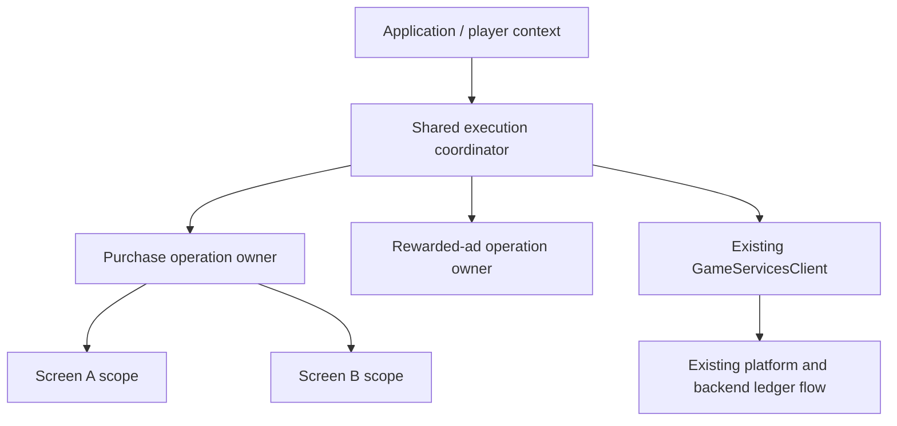

# Game runtime (private preview)

`@mpgd/game-runtime` coordinates gameplay execution with owned block tokens.
It has no Phaser, DOM, network, platform SDK, timer, or polling dependency.
It does not change engine state, replace score-oriented `GameSession`, or alter
`PlatformGateway`. Engine and UI consumers apply the requested state separately.

```ts
import { createGameExecutionController } from '@mpgd/game-runtime';

const runtime = createGameExecutionController({ onListenerError: reportError });
const settings = runtime.acquireBlock({
  reason: 'settings', channels: ['simulation', 'gameplay-input'],
});
const background = runtime.acquireBlock({
  reason: 'background', channels: ['simulation', 'gameplay-input', 'audio'],
});
background.release(); // Settings still blocks simulation and gameplay input.
settings.release();   // Those channels may now resume.
runtime.destroy();    // Terminal; this never requests gameplay resume.
```

| Channel | Request |
| --- | --- |
| `simulation` | Stop gameplay simulation updates |
| `gameplay-input` | Block gameplay input, leaving pause/resume UI usable |
| `rendering` | Suppress gameplay rendering according to the engine binding policy |
| `audio` | Mute gameplay audio through an explicit audio sink |

Each channel is blocked while any token includes it. Equal reasons create
independent tokens. Only the returned token can release its block; diagnostic
IDs are local to a controller and cannot be used to release anything. Release
and unsubscribe are idempotent. Keep an additional token for user-confirmed
resume; the core supplies no countdown or automatic resume policy.

`getSnapshot()` returns the same reference until a successful acquisition,
first release, or first destruction. Each increments `version` once, including
changes to token diagnostics that leave the effective channel flags unchanged.
Snapshots, channel flags, token lists, token information, and channel arrays
are frozen. Caller arrays are copied; no consumer object is frozen.

`subscribe` does not emit initially: subscribe, then read `getSnapshot()`.
Listeners run in registration order. Each notification round captures its
snapshot and recipient list. Reentrant state changes are immediate but their
notifications queue behind the current round. Newly registered listeners only
receive future rounds; unsubscribed listeners are skipped even in a captured
round. Read the callback argument for that round's state, since `getSnapshot()`
may already reflect a reentrant change. Duplicate registrations are independent.

Synchronous exceptions and rejected listener promises go to optional
`onListenerError`. Promises are observed without awaiting them. Errors from
that hook are consumed; no global logging or transport is installed. Listeners
must not produce an unbounded cycle of state changes.

`destroy` is terminal and idempotent. It clears owned blocks, emits a terminal
snapshot with every channel blocked, and removes listeners. Destruction also
supersedes outstanding active notification rounds, preventing a stale resume
notification after shutdown. Late token releases are no-ops; new acquisitions
and subscriptions throw. Destroying this coordination object does not terminate
the game process. Consumers must check `status` before applying engine controls.

This package remains `private: true` until an initial local npm publish and
Trusted Publishing/OIDC setup are explicitly completed. It is not a generated
game dependency. These private-only changes require no Sampo changeset.

Contributor validation: `pnpm --dir packages/game-runtime test`,
`node tools/run-ttsx.mjs tools/package/build-packages.ts @mpgd/game-runtime`,
and `node packages/game-runtime/test/dist-import.mjs`.

## Scoped UI bridge

`@mpgd/game-runtime/ui` is a separate, headless entrypoint. Importing the root
execution controller does not load the UI bridge. The bridge separates persistent
snapshots, user-intent commands, and one-time events. Multiple command handlers
are allowed and run in registration order; dispatch is not a success result or
proof that a purchase or reward was granted. Events have no replay or history.

```ts
import { createGameUiBridge } from '@mpgd/game-runtime/ui';

const bridge = createGameUiBridge<
  { count: number }, { type: 'refresh' }, { type: 'refreshed' }
>({ initialSnapshot: { count: 0 }, onListenerError: reportError });
const screen = bridge.createScope();
screen.subscribeSelector((state) => state.count, renderCount);
renderCount(bridge.getSnapshot().count); // Subscriptions do not emit initially.
screen.onCommand(async () => {
  const count = await readCount();
  screen.setSnapshot({ count });
  screen.emit({ type: 'refreshed' });
});
screen.dispatch({ type: 'refresh' });
screen.dispose(); // A later readCount result cannot update this or a new screen.
```

`getSnapshot()` remains referentially stable until `setSnapshot` receives a value
that differs under `Object.is`. Snapshots and command/event payloads belong to the
consumer: publish immutable values and replace changed state. The bridge neither
deep-clones nor freezes arbitrary consumer or engine objects. Only bridge and
scope API containers are frozen; listener lists and pending deliveries stay
private. There is no frame-based copying, timer, or global singleton.

`subscribeSelector(selector, listener, equality = Object.is)` evaluates its
initial selection without notifying. Unchanged selected values suppress delivery.
Selectors and equality functions must be pure. Initial selector failures reject
registration; subsequent selector, equality, or listener failures are isolated
and reported through `onListenerError`. A failed selection leaves the previous
selection intact. An invoked listener receives the new selection even if another
listener changed current state reentrantly.

All notifications share one FIFO delivery queue. Each dispatch captures its
value and recipients. Reentrant mutations update current state immediately, but
their notifications run after the current round. Unsubscribed recipients are
skipped and new registrations wait for future dispatches. Duplicate registrations
are independent. As with the execution controller, synchronous exceptions and
rejected promises are observed without awaiting; errors from the optional error
hook are consumed. Observation failure never converts a business operation into
failure. Avoid self-sustaining dispatch cycles.

Scopes own subscriptions and cleanup via `own(cleanup)`. Its returned function
releases that resource once, and removes it from the scope's retained cleanup
set. Disposal first revokes callback and commit permission, then runs registered
cleanups in registration order. Cleanup errors do not prevent remaining cleanup.
An asynchronously acquired resource passed to `own` after disposal is immediately
released. This is the one deliberately supported late registration; ordinary new
subscriptions on a disposed scope throw.

After disposal, scoped `setSnapshot`, `emit`, and `dispatch` return `false`.
They cannot affect another screen scope. Raw bridge methods are application-owner
APIs; passing those directly to a screen's asynchronous work bypasses this guard.
Scope disposal does not cancel a request, server verification, or reward claim.
Such business operations need an owner whose lifetime exceeds the screen.

Bridge destruction disposes all scopes, removes listeners and queued deliveries,
and rejects new registration, dispatch, emit, or setSnapshot calls. The final
snapshot remains readable. Disposal, destruction, and unsubscribe are idempotent;
late scoped commits still return `false` after bridge destruction.

The UI subpath shares the private package's publication prerequisites. No Sampo
changeset or generated-game dependency is added for this private-only extension.

## Platform lifecycle binding

Import `bindGameLifecycle` from `@mpgd/game-runtime/platform`. Supply a controller,
a minimal `source` with `onPause`/`onResume` subscriptions (compatible with
`PlatformGateway.lifecycle`), and either an explicit `initialState` or a
`readState()` callback. States are `active`, `inactive`, and `unknown`; unknown
conservatively blocks. Default channels are all four execution channels.

Subscriptions install before reading current state. Events received during
installation override an explicit initial state; an event during `readState`
overrides that read's return value. A readable source should return its current
state synchronously. No DOM or SDK is imported and LifecycleAdapter is unchanged.

Each binding owns at most one token. Duplicate pause/resume events are idempotent;
a resume cannot release settings or another source's block. `dispose()` removes
subscriptions and releases only its own token. Source callbacks captured before
disposal become harmless, and controller destruction automatically detaches the
binding. Setup failures clean installed subscriptions; optional `onError` observes
cleanup errors without preventing remaining cleanup.

```ts
const lifecycleBinding = bindGameLifecycle({
  controller: runtime,
  source: gateway.lifecycle,
  initialState: 'unknown',
});
// A later source resume can release this binding's conservative startup block.
lifecycleBinding.dispose();
```

## Purchase and rewarded-ad actions

`@mpgd/game-runtime/actions` provides `createGameActionCoordinator`,
`createPurchaseActionController` and `createRewardedAdActionController`. Inject the
existing `GameServicesClient` (or its DOM-free `GameServicesOperationClient` port).
The controllers call only `purchase` and `claimRewardedAd`; they do not call an SDK,
verify a receipt, retry a transaction or grant local currency.

```ts
import { createGameExecutionController } from '@mpgd/game-runtime';
import { createGameActionCoordinator } from '@mpgd/game-runtime/actions';
import { createGameUiBridge } from '@mpgd/game-runtime/ui';

// Application lifetime: one coordinator per runtime/client/player context.
const execution = createGameExecutionController();
const coordinator = createGameActionCoordinator({ execution, client });
const purchase = coordinator.createPurchaseController();
const ui = createGameUiBridge<string, never, string>({ initialSnapshot: 'idle' });
const screen = ui.createScope();
const view = purchase.bindScope(screen, {
  snapshot: (value) => value.status,
  event: (value) => `purchase:${value.status}`,
});
const result = view.execute({ productId: 'example', source: 'shop', idempotencyKey: suppliedKey });
screen.dispose(); // Detaches this screen; the service invocation and its block continue.
await result; // The owner also retains its safe completion snapshot through getSnapshot().
```



An owner outlives its views. `subscribe` observes safe owner snapshots without an
initial delivery. `bindScope` projects only operations explicitly executed or joined
through that view; merely opening screen B never subscribes B to screen A's old
completion. Scope disposal removes UI subscriptions and commit authority. It does
not cancel the service promise. Owner `dispose` rejects new executions and removes
owner UI listeners, but preserves the eventual snapshot of an already started
operation. Coordinator disposal prevents new work across its owners. Neither
kind of disposal claims to roll back an external purchase.

| State | Meaning and handling |
| --- | --- |
| `idle` | No operation observed by this owner. |
| `running` | Local service call in flight; optional `progress` is a real service observation. |
| `granted` | Existing service result reports a grant. Read authoritative economy state through existing APIs. |
| `cancelled` (purchase), `skipped` (ad) | Preserve the service outcome. No automatic retry. |
| `pending` (purchase) | Unresolved transaction; local gameplay block ends, reconciliation is still required. |
| `unavailable` (ad) | Service cannot provide this ad. |
| `rejected` / `failed` | Preserve these distinct service outcomes; no local grant and no automatic retry. |
| `exception` | Call threw; final transaction result is unknown. Original error rejects the returned Promise, not the UI snapshot. |

Snapshots contain only kind, status, coordinator-local operation ID and whitelisted
progress fields. They never contain receipt/evidence, raw server bodies, ledger
objects, player identity or provider error text. Progress does not prove grant or
native UI visibility/closure. A legacy client that ignores options stays `running`
until its result settles. Listener and projection errors, including rejected async
listeners, are isolated through `onObserverError`.

Each local invocation owns a simulation/gameplay-input token from before the service
call until settlement. Settings/background tokens remain independent. No timer,
SDK-visibility guess, polling or `Promise.race` releases a block early. A `pending`
result releases this local block but is not considered a cancelled transaction.

The coordinator serializes purchases and ads for its injected client. Identical
in-flight keys/inputs share the exact Promise across recreated owners. A key reused
with a different kind, product, source or placement rejects with `key-conflict`.
Different in-flight work rejects with `busy`. The most recent completed operation
can be explicitly observed again through the retained Promise; earlier completed
keys reject with `already-completed` and are never re-invoked.

Only input fingerprints are remembered, at most `maxRememberedKeys` (default 1024,
allowed 1–10000). Keys are never evicted silently: reaching the bound rejects new
keys with `history-full`. The coordinator retains at most one completed result
Promise, not an unbounded result/event log. It is scoped to the current process;
server ledger idempotency remains authoritative. Creating another coordinator or
restarting the process is outside this guarantee. Do not recreate it per screen or
to bypass unresolved work, and do not generate a new key for each UI retry.

After `pending` or an invoked operation exception, new keys reject with
`reconciliation-required`. The current client has no recovery/requery port, so this
version deliberately provides no reset/retry/polling API. Integrate the existing
provider/backend recovery policy outside these UI actions before starting a new
application coordination session. Do not treat a retryable hint as permission to
repurchase. Input/preflight scheduling rejections occur before the service call and
do not invent a business outcome.

Packaging: `/actions` uses **type-only** imports from `@mpgd/game-services/operations`.
The workspace dependency ensures declarations/build order; neither the basic
runtime import nor actions import loads the service implementation, Phaser or DOM.
Consumers use the repository-standard `skipLibCheck` for third-party typia
ambient declarations; the headless consumer smoke supplies only ES2022 globals.
This package remains private. Future publication requires initial npm registration,
OIDC, and the game-services release containing `/operations` and progress options
(planned 0.15.0). No generated game gains a dependency on this unpublished package.

The owner that reserves an operation controls its pre-invocation startup permission.
A reentrant same-key joiner cannot cancel that owner's startup by disposing itself.
If owner/runtime disposal prevents any client invocation, the flight rejects with
a scheduling error, resets its observed state to `idle`, and emits no business
completion/exception event. An invoked client failure remains `exception`.
